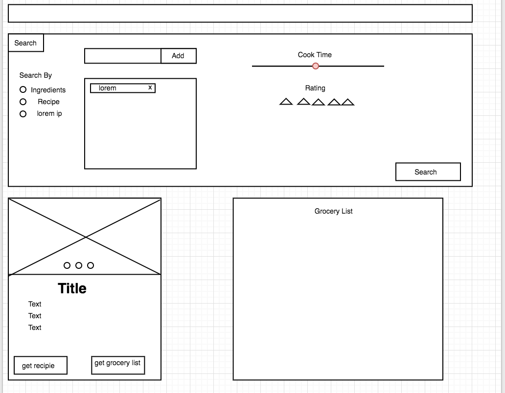

# Welcome to YardToTable

This site was created to simplify recipe searching while keeping the high level of functionality users would expect. Search by recipe, ingredient, cook time, rating, course, and cuisine.  Use as many of these attributes as you would like!

YardToTable uses both the Google Maps API and the Yummly API to generate data in accordance with search terms. Once a search is performed you may view the recipie, ingredients, generate a grocery list and view the closest grocery store to you.

This is a fully responsive web application and can be viewed on your mobile device, tablet, or computer.

## To Get Started

- go to [yardtotable](https://yardtotable.surge.sh)

  

- click the "get started" link and you will land here:

  

- when you arrive at the [search page]("https://yardtotable.surge.sh/search.html"), select Search by ingredients or Recipe, then enter in your search terms **one at a time** to the text input, then press add.  NOTE: if you are searching by Recipe you may only enter one term (ex. Onion Soup).  If you would like to add other attributes like cuisine type or courses select your preference from the dropdown.   If you would like to search by max cook time use the slider bar to change the number of minutes. You may also search by minimum rating by clicking the number of stars you want the recipe to have then press search. You will land here:

  

  ​

- from here you can click on the ingredients link on each of the cards to generate a modal that provides you the ingredients for each recipe.

  

- from here you can click out and back to the previous display 

- you can also press the "get recipe" button and generate another modal:

  

- from here you can click out and back ot the previous display

- you can also press the "get grocery list" button to generate a grocery list and a map of the grocery stores near you:

  

  ​

- you can then press the search icon button at the top left of the page to open the search window and perform another search.

## Additional Directions

#### Technologies Used

- HTML5
- CSS3
- Bootstrap v3.3.7
- JavaScript
- jQuery 3.2.1
- Yummly API
- Google Maps API (Places, Geolocation)

#### Wireframe

#### MVP Goals

- search recipe and ingredients using yummly and populate screen with cards that give picture, ingredients, rating, and time.

##### Pivotal tracker

- [My tracker](https://www.pivotaltracker.com/n/projects/2017761)

  ​

##### GitHub Repo

- [YardtoTable Repo](https://github.com/speichs/Q1Project)

  ​